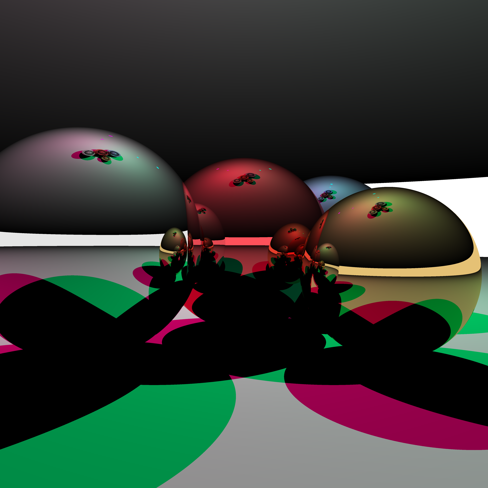

# 3D-Rendering

## Overview
Two 3D rendering implementations, one being a basic ray tracing program based off of [Scratchapixel's raytracer](https://www.scratchapixel.com/lessons/3d-basic-rendering/introduction-to-ray-tracing//raytracing-algorithm-in-a-nutshell.html) and the other being an implementation of [TinyRenderer](https://haqr.eu/tinyrenderer/).

I decided to embark on this project because it seemed fun and specialised in a lot of maths which I am unfamiliar with (mainly matrices).

## How it works
### Raytracer
For each pixel, a ray is casted into the scene and checks for all objects it hits. The closest hit is checked, if it is a diffuse material then the point hit is coloured according to the closest light source, but if the material is instead reflective or refractive, a reflected and/or refracted ray is shot from the hit point, recursively calling this trace function to find the colour of the pixel/point hit. A major drawback of this short algorithm is that shadows look really bad.

### 3D_Renderer
Bresenham - Given two points, the algorithm iterates across x or y values (depending on the slope of the line to ensure that pixels aren't skipped) and uses very basic algebra (using y=mx+c formula) to draw each pixel on the line.

Wireframe - Uses bresenham's formula between every vertex of every triangle in the given model to draw a wireframe image of the model.

Triangle Rasterization - Draws lines between left and right sides of the triangle to rasterize each triangle. Quite similar to bresenham's algorithm with finding the left and right sides of the triangle at any given y value.

Bounding Box Triangle Rasterization - Creates a bounding box around the vertices of an inputted triangle and then, for each pixel in the box, checks if it inside the triangle by computing the barycentric coordinates of the pixel from the vertices of the triangle and then checking if any of the weightings are negative (which would mean that the pixel is outside of the triangle). This is computationally efficient when it comes to the GPU and barycentric coordinates are also very helpful for the later shader algorithms.

Basic Model Rendering - It's just the wireframe rendering with the bounding box rasterization. But also there's rotations now.

Basic Model Rendering (with matrices) - Refactors the previous algorithm, using matrices (and homogenous coordinates too) to transform between world, camera and screen spaces.

Phong Shader - Refactors previous code to follow more closely to a rendering pipeline in which only fragment and vertex shaders can be changed. Uses a basic phong shader to calculate the colour of each fragment on a model with ambient, diffuse and specular lighting. Ambient lighting is always there, diffuse is based on how much the light the surface receives (which is a directional light, not a point light) and specular lighting accounts for when a surface is closest to perfectly reflecting light instead of just scattering it (like with diffuse lighting).

Phong Shader With Normal Mapping and UV mapping and shadows - Uses barycentric coordinates to interpolate between the current triangle's vertices for normals and uv maps (which includes diffuse colours, specular mapping and glow mapping) for each fragment. Also shadows are created with a prepass of the scene from the light's perspective, then using this zbuffer as well as matrix transformations to map each fragment of the actual render to the light buffer, checking if the fragment is illuminated or not.

Light depth buffer:

Toon Shader - uses original phong shader (+ the shadow mapping) and then sorts each colour into distinct bands, and then applies a post-processing pass over the image to detect edges using the Sobel filter, which essentially detects any large changes in depth for every pixel in the image.

## Usage
### Raytracer
Run the executable ray_tracer.out and send the output to a .ppm file (e.g. `./ray_tracer.out > img.ppm`). Alternatively compile ray_tracer.cpp first using clang or g++ and the execute the compiled file. 

The sphere objects can be modified in the main function of ray_tracer.cpp before compiling for different scenes.

### 3D_Renderer
Executables are found under the bin folder of 3D_Renderer. Each one demonstrates various steps along the way of creating the 3D renderer. Each executable creates a .tga image file as output as well as a lightbuffer and depthbuffer .tga image. Example .obj files are in the objects file (demon model is taken from TinyRenderer, the floor and terrible looking puffin head were scrappily made by me).

bresenham.out -> Uses bresenham's line drawing algorithm to rasterize lines. Usage: `./bresenham.out`

wireframe.out -> Uses bresenham's line drawing for wireframe rendering of an .obj file. Usage: `./wireframe.out path/to/.obj`

triangle_rasterization.out -> Rasterizes triangles by drawing lines between left and right sides of triangle. Usage: `./triangle_rasterization.out`

bounding_box_rasterization.out -> Rasterizes triangles by checking every pixel within the triangle's bounding box. Usage: `./bounding_box_rasterization.out`

basic_model_rendering.out -> Renders an .obj file with random colours, using the bounding box rasterization. Usage: `./basic_model_rendering.out path/to/.obj`

matrix_refactor.out -> Same as basic_model_rendering but uses matrices for transformations, such as between worldspace to cameraspace to screenspace. Usage: `./matrix_refactor.out path/to/.obj`

phong.out -> Basic phong shading. Usage `./phong.out path/to/1.obj path.to/2.obj ...`

phong_nm.out -> Phong shading with smoothing using vertex normals, uv mapping for diffuse, glow and specular maps and basic shadows. Usage `./phong_nm.out path/to/1.obj path.to/2.obj ...`

toon_shading.out -> Basic toon shading with sobel edge detection. `./toon_shading.out path/to/1.obj path.to/2.obj ...`

Each binary was compiled using clang under the C++17 standard